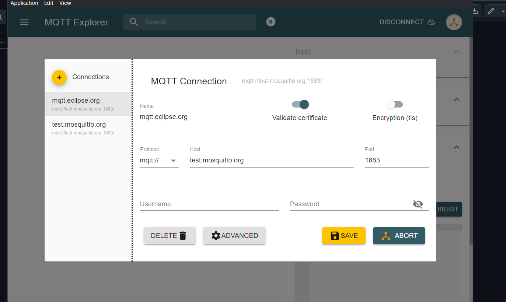
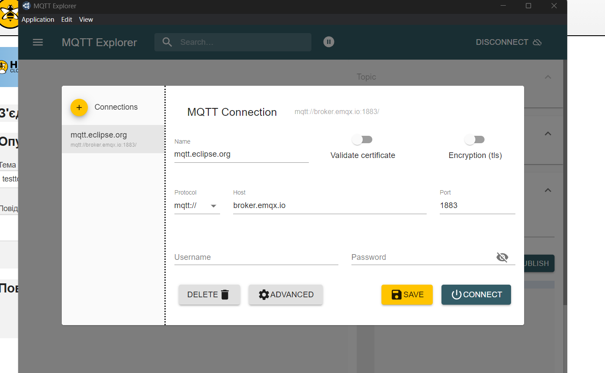

# Лабораторна робота №10. Протоколи IoT: MQTT

# MQTT: практична частина

### 1. Використання тестових клієнтів та брокерів для зв'язку по MQTT

## я змінив хоста бо початкові не запускались або блокувались 

