## 1.установка даш борд

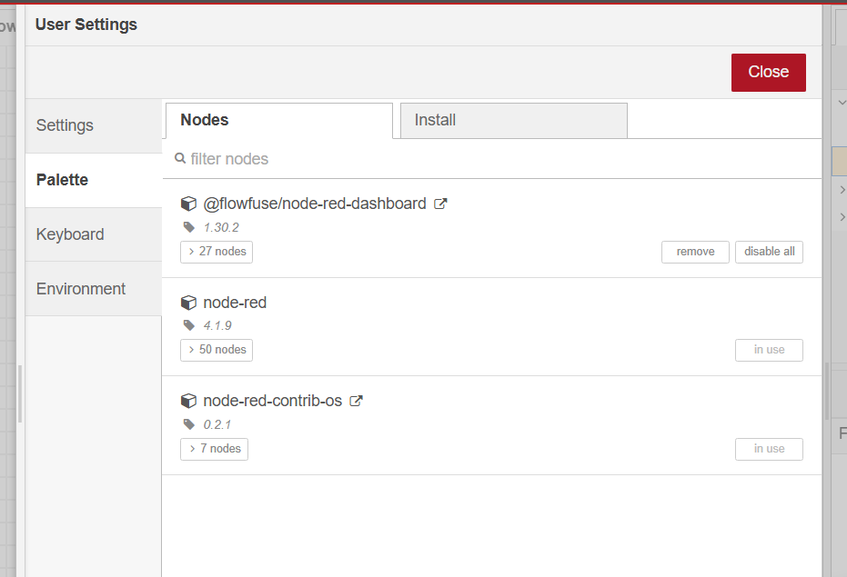

## 2.налштував inject

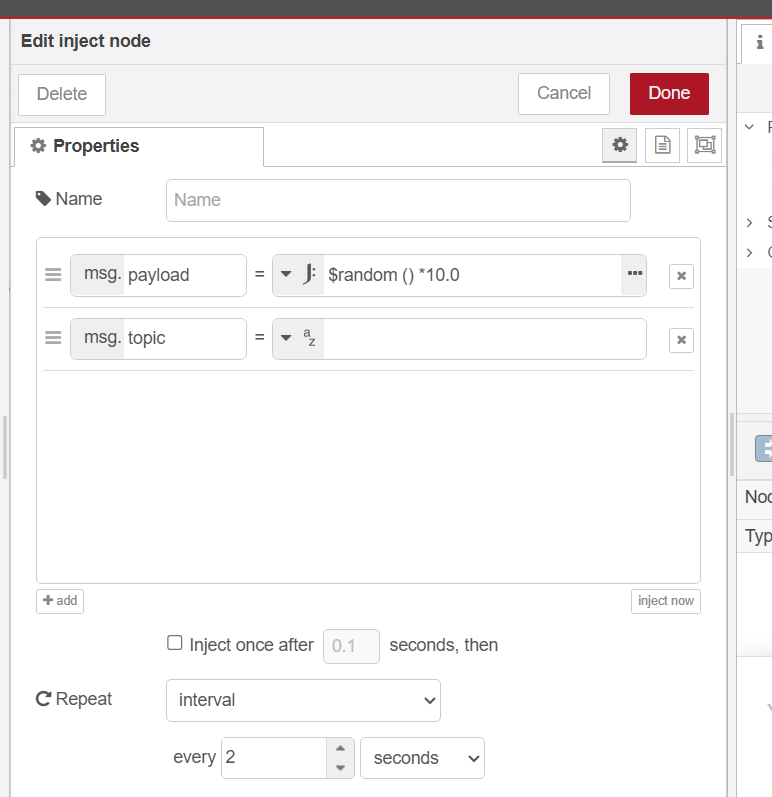

## 3.Налаштування dashboard

### запуск 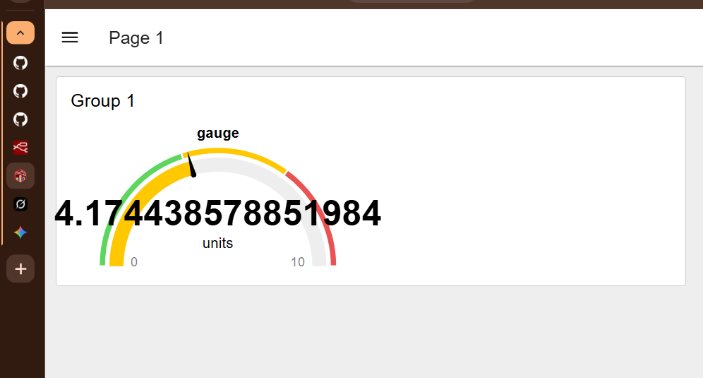

### налагтування 

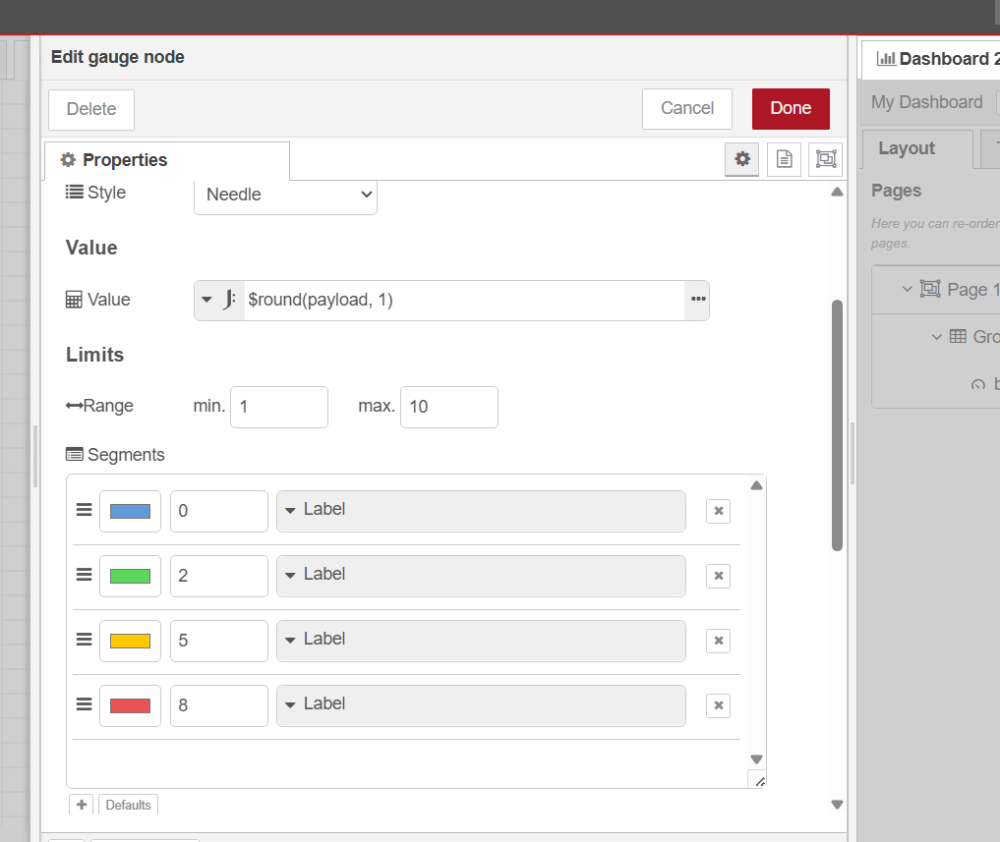

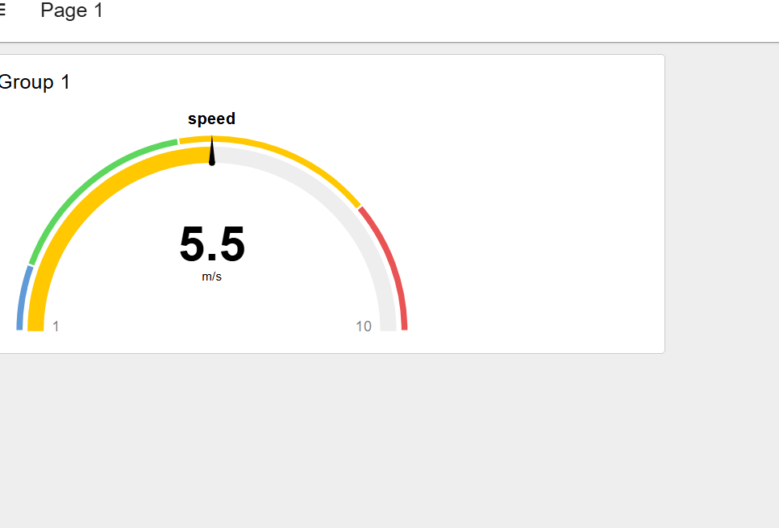

## 4.переробка groop

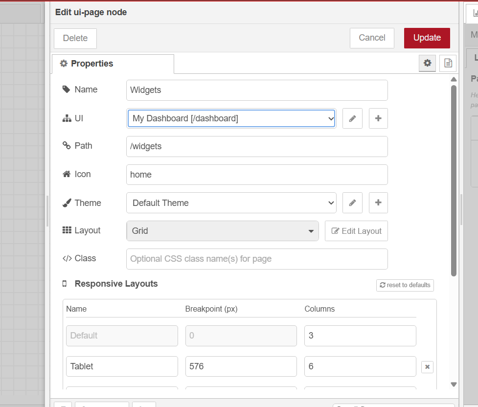

## 5.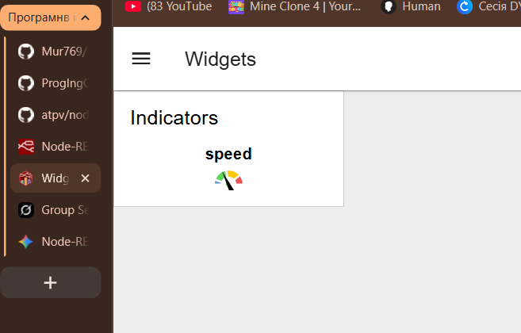

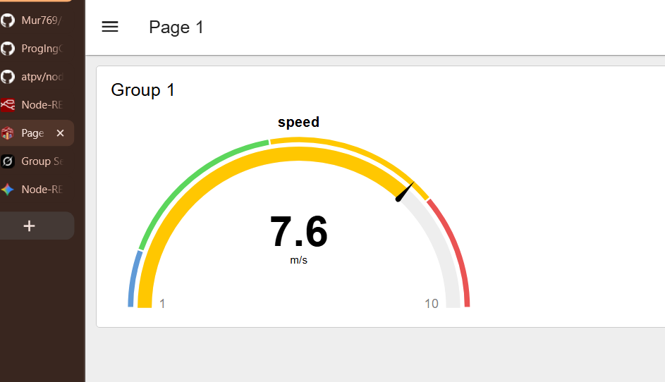

## 2.група як на рис.9

## 6.група по горизонталі 

## 7. різні варіанти відображення

## 8. Знайомство з віджетами керування

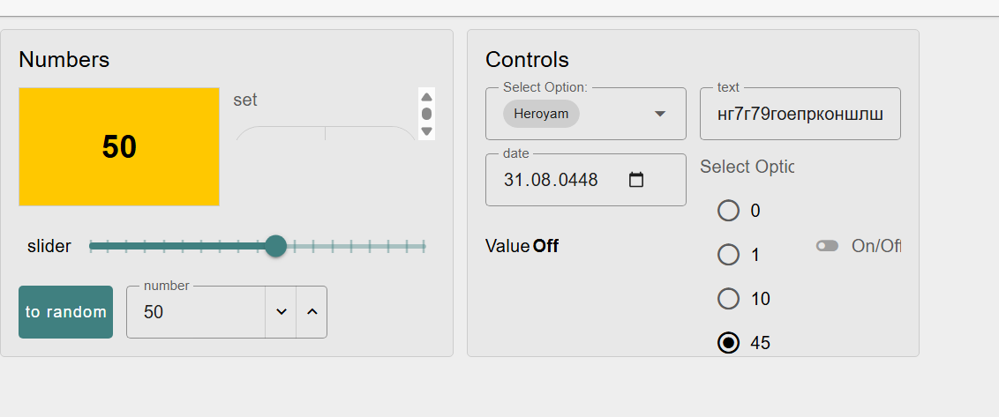

## Робота з таблицями

## 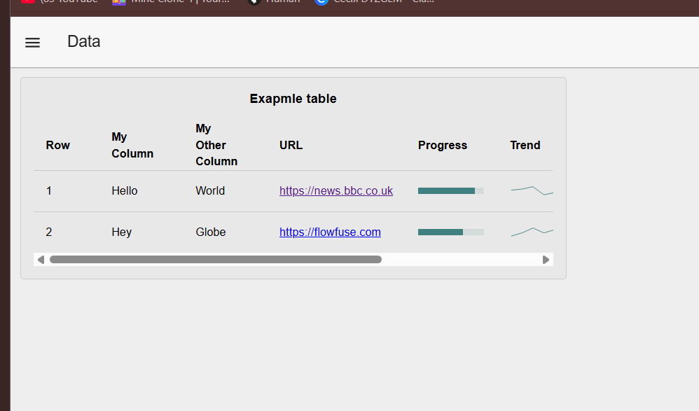

## колонка num 

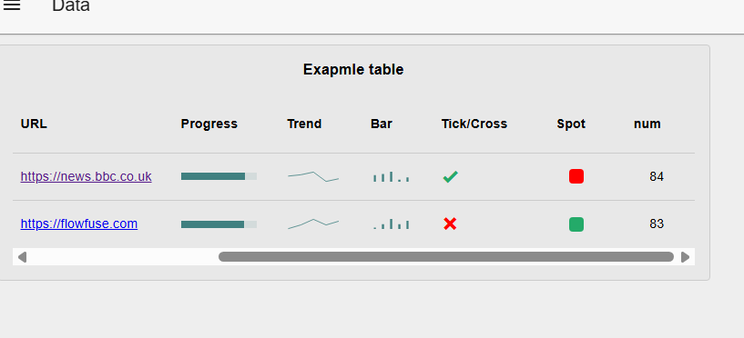

## [код з лабораторною](Lab4.json)
