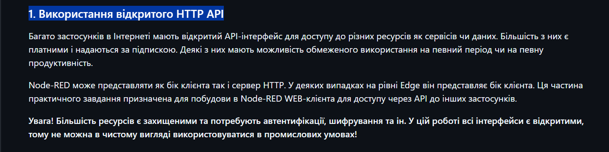
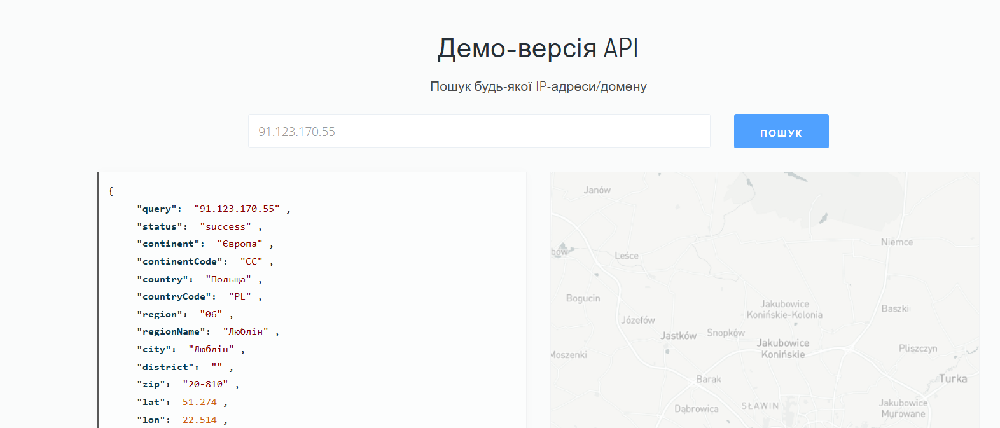
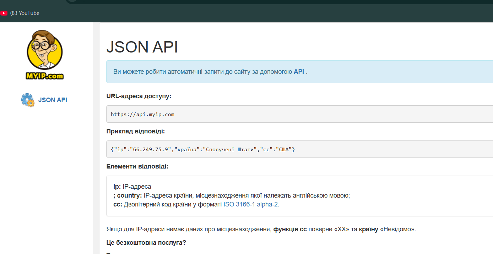
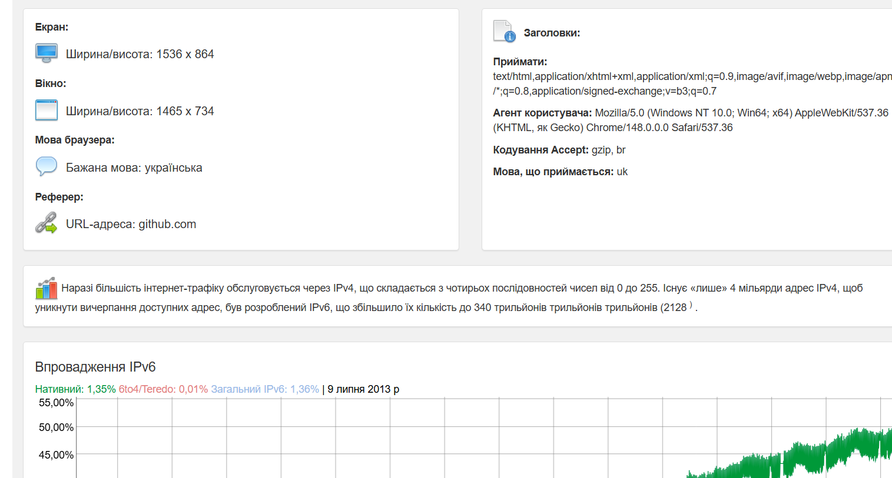
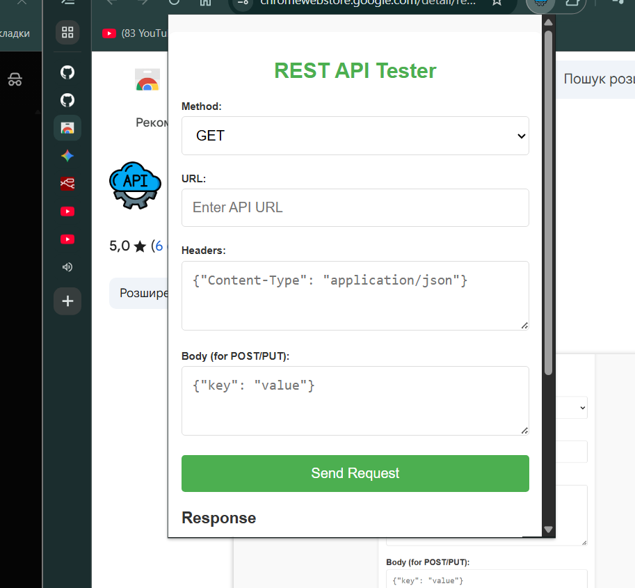
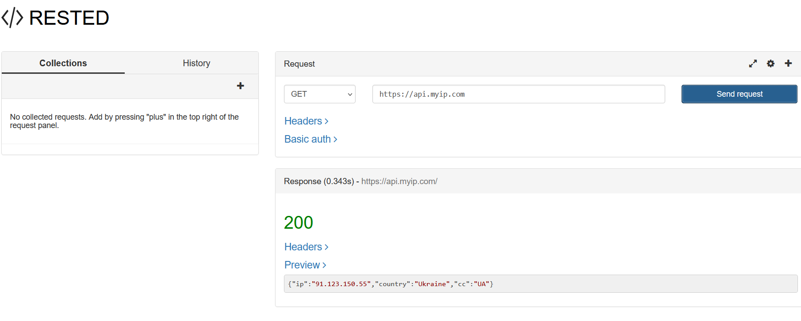
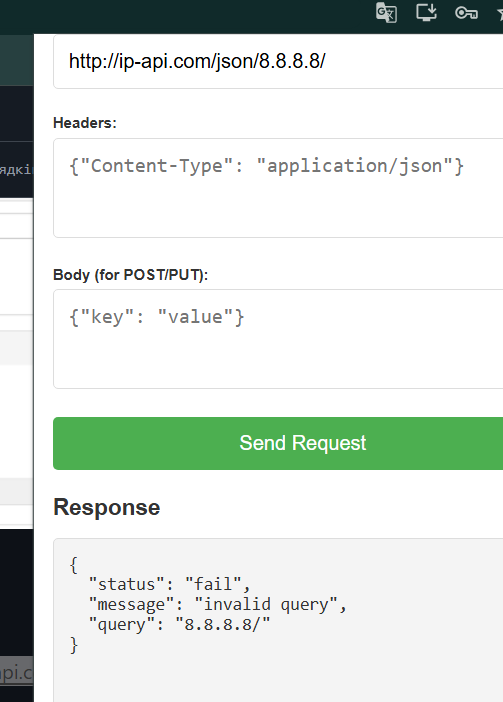
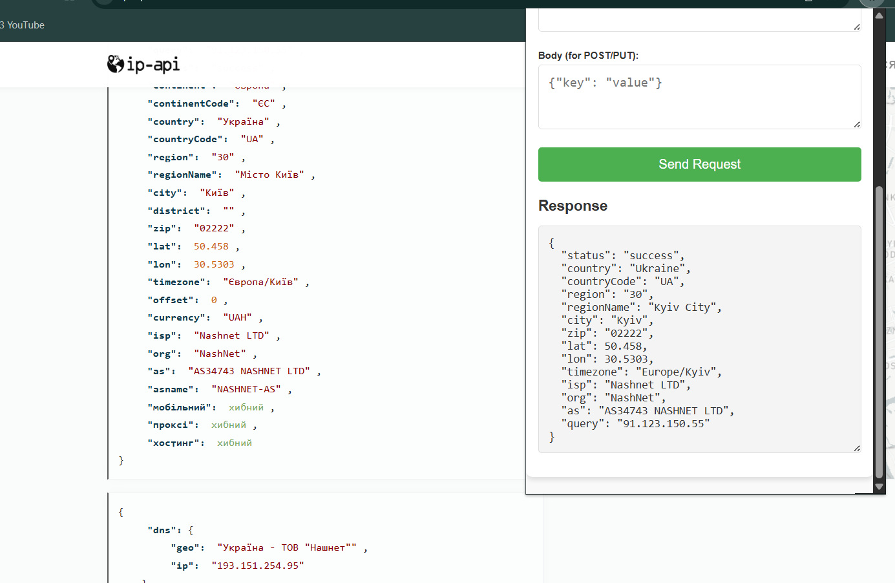
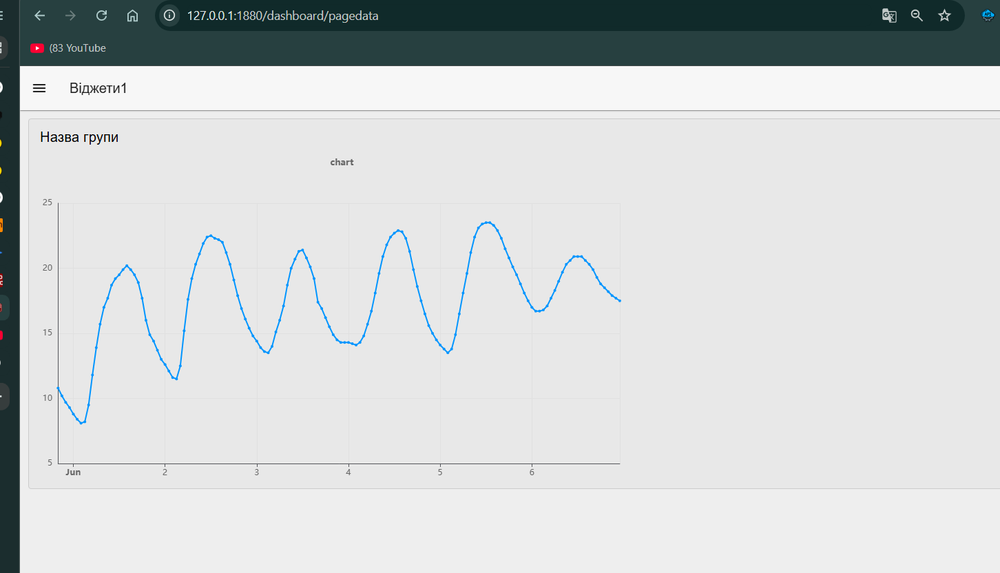

# Лабораторна робота №9. Основи роботи з HTTP API

###  Використання HTTP API 

все що тут буде показано і зроблено не зроблено для роботи на промислових підприємствах бо вони не захищені паролями або іншим захистом

### 1. Використання відкритого HTTP API

### 2. Знаємство з сервісами IPAPI

## ознайомлення

### 3. Робота з утилітами для API-тестування

### розширення для тесту API для браузера

### 4. Створення клієнта для IPAPI в Node-RED

### 5. Виведення прогнозних даних по температурі та опадам

